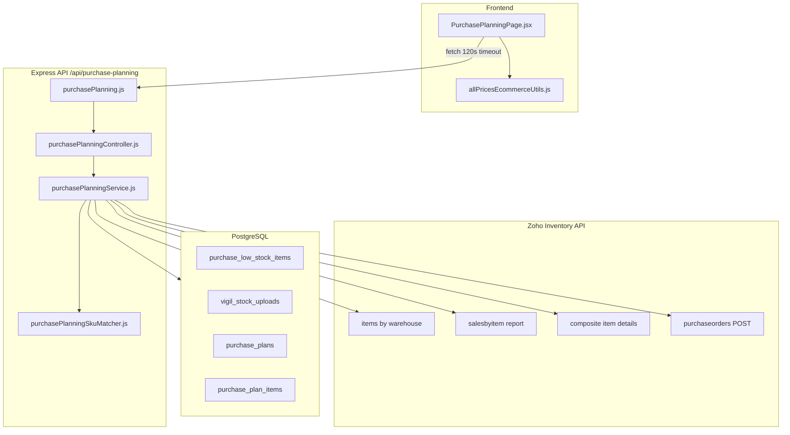
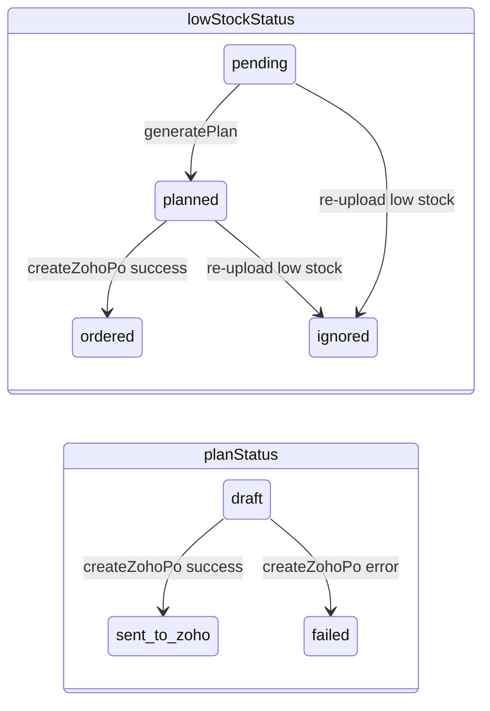
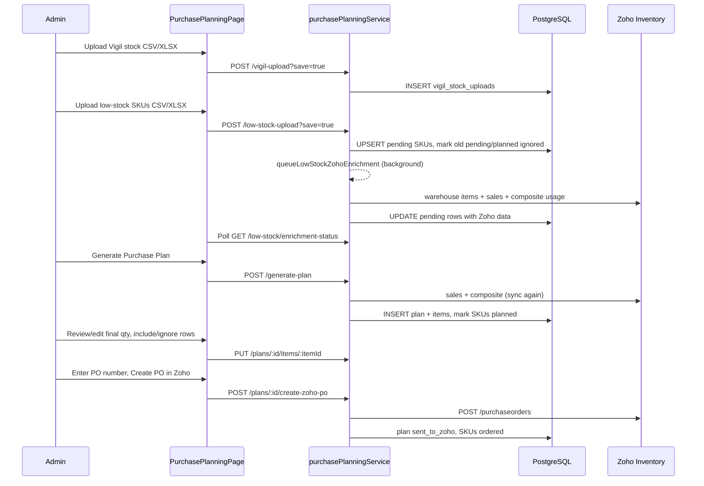
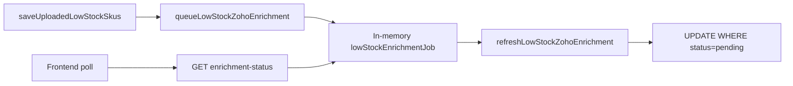

# Purchase Planning Module — Architecture & Process Guide

## Purpose

Purchase Planning helps admins turn **reported low-stock SKUs** into a **reviewed draft purchase order** sent to **Zoho Inventory**. It combines three data sources:

| Source | What it provides |
|--------|------------------|
| **Uploaded low-stock list** (CSV/XLSX) | Which SKUs need reordering |
| **Zoho Inventory** | Item names, warehouse stock (Life Smile), 3-month direct sales, composite/bundle usage |
| **Vigil wholesale stock file** (CSV/XLSX) | Available wholesale qty to cap order sizes |
| **All Prices** (client user prefs) | Purchase unit prices at PO creation time |

Route: `/management/purchase-planning` (Admin only) — `src/App.jsx`

---

## High-Level Architecture



### File map

| Layer | Path | Role |
|-------|------|------|
| Routes | `backend/src/routes/purchasePlanning.js` | 13 endpoints, multer 5MB uploads, `requireAuth` + `requireAdmin` |
| Controller | `backend/src/controllers/purchasePlanningController.js` | Validation, HTTP codes, error mapping |
| Service | `backend/src/services/purchasePlanningService.js` | All business logic (~1400 lines) |
| SKU matcher | `backend/src/utils/purchasePlanningSkuMatcher.js` | Normalize SKUs, match Zoho SKU → Vigil item code |
| UI | `src/pages/management/PurchasePlanningPage.jsx` | Single-page UI (~1300 lines): upload panels, plan table, PO actions |
| Styles | `src/pages/management/PurchasePlanningPage.css` | |
| Tests | `backend/tests/purchasePlanningController.test.js`, `backend/tests/purchasePlanningSkuMatcher.test.js` | Controller validation + matcher/unit helpers only |
| DB bootstrap | `backend/src/db/index.js` | Calls `ensurePurchasePlanningTables()` at startup |

Tables are created at runtime in `ensurePurchasePlanningTables()` (not only via migrations). Migration `backend/migrations/018_purchase_low_stock_sales.sql` adds sales/bundle columns.

---

## Data Model



### `purchase_low_stock_items`

- **One row per SKU** (unique on `sku`)
- Stores Zoho enrichment: `item_name`, `zoho_item_id`, `current_zoho_stock`, `total_sales_last_3_months`, `total_bundle_usage_last_3_months`
- **Status**: `pending` | `planned` | `ordered` | `ignored`
- Vigil fields are **not persisted** — recomputed on read from latest Vigil upload

### `vigil_stock_uploads`

- Full parsed rows stored as JSONB (`parsed_rows`)
- Latest upload by `uploaded_at DESC` drives all Vigil matching

### `purchase_plans`

- `plan_number` (e.g. `PP-20260529061215-MVVZ`)
- `status`: `draft` | `reviewed`* | `sent_to_zoho` | `failed` (*`reviewed` exists in schema but is never set)
- `source_upload_id` → Vigil upload used at generation time (stored but refresh currently uses **latest** upload)
- `zoho_purchase_order_id`, `zoho_error`

### `purchase_plan_items`

- Snapshot per SKU at plan generation (or refresh): stock, sales, bundle, suggested/final qty, Vigil match, included flag, notes, optional `purchase_price`

---

## End-to-End Process (Happy Path)



### Step-by-step

**1. Upload Vigil wholesale stock** (`UploadPanel`)

- Parses item code + available stock columns (flexible header names)
- Preview optional; save requires zero invalid rows
- Required before plan generation

**2. Upload low-stock SKUs** (`LowStockUploadPanel`)

- Parses SKU from first column or SKU header
- **Fast save**: writes minimal rows to DB (`status=pending`, zeros for Zoho fields)
- **Background enrichment**: `queueLowStockZohoEnrichment()` → fetches Zoho data for all `pending` SKUs
- UI polls `GET /low-stock/enrichment-status` until `running=false`
- Manual refresh: `POST /low-stock/refresh-zoho`

**3. Generate plan**

- Preconditions: latest Vigil upload + at least one `pending` low-stock SKU
- If any pending SKU lacks `zoho_item_id`, runs synchronous `refreshLowStockZohoEnrichment()` first
- Fetches 92-day Zoho sales + composite bundle usage
- For each pending SKU: match Vigil, compute quantities, insert plan line, mark SKU `planned`
- UI blocks Generate while enrichment runs or SKUs lack Zoho IDs

**4. Review draft** (`PlanTable`)

- Sort/filter columns: stock, wholesale, sales, bundle, suggested/final qty
- Edit `finalQty`, toggle `included`
- Purchase prices shown from **All Prices** client prefs (not server DB until PO)
- Optional: **Refresh Zoho data** on draft → re-pulls Zoho + recalculates all lines (overwrites manual edits)

**5. Create Zoho PO**

- Admin enters PO number; prices sent from All Prices lookup
- Backend validates: included lines, `finalQty > 0`, `zohoItemId`, price > 0
- POST to Zoho `/purchaseorders`; on success plan → `sent_to_zoho`, SKUs → `ordered`

---

## Quantity Calculation Logic

Defined in `calculatePlanQuantities` in `backend/src/services/purchasePlanningService.js`:

```
totalUsage = totalSalesLast3Months + totalBundleUsageLast3Months
averageMonthlyUsage = totalUsage / 3
suggestedQty = ceil(totalSales + totalBundle)
finalQty = min(suggestedQty, vigilWholesaleAvailable)
included = finalQty > 0 AND vigil matched AND wholesale > 0
```

**Notes auto-set:**

- No Vigil match → "No matching Vigil stock row"
- Vigil qty 0 → "Unavailable in wholesale stock"
- Suggested > Vigil → "Vigil stock below required usage; final qty auto-adjusted"

**Bundle/composite usage:**

- Scans 92-day sales lines for composite-looking SKUs (MIX, SET, KIT, etc.)
- Fetches up to **80** composite item definitions from Zoho (`MAX_COMPOSITE_USAGE_LOOKUPS`)
- Rolls component usage back to individual SKUs

**Direct sales:**

- Aggregated from Zoho `salesbyitem` report over last 92 days (~3 months)

---

## SKU Matching (Zoho ↔ Vigil)

`backend/src/utils/purchasePlanningSkuMatcher.js`:

- **Normalize**: uppercase, trim, unify dashes/spaces
- **Vigil indexes**: exact variants + parent/color-stripped variants (e.g. `LIFEP5-16-GREEN` → parent `LIFEP5-16`)
- **Match types**: `exact` | `parent` | `not_found`
- Used for: low-stock Vigil display, plan line wholesale qty, PO stock status badges

**Zoho item matching** (in service):

- Builds index from warehouse-scoped item list
- Matches uploaded SKU against item code, name, part number variants

---

## API Reference

All routes under `/api/purchase-planning`, admin auth required, client timeout **120s** (`PURCHASE_PLANNING_TIMEOUT_MS` in `src/api/client.js`).

| Method | Path | Purpose |
|--------|------|---------|
| GET | `/low-stock` | List pending low-stock SKUs (Vigil joined at read time) |
| GET | `/low-stock/enrichment-status` | Background job: running, lastError, lastSummary |
| POST | `/low-stock-upload` | Preview or save low-stock file (`?save=true`) |
| POST | `/low-stock/refresh-zoho` | Queue background enrichment |
| POST | `/vigil-upload` | Preview or save Vigil file (`body.save=true`) |
| GET | `/vigil-uploads` | Last 50 uploads |
| POST | `/generate-plan` | Create draft plan from pending SKUs |
| GET | `/plans` | List plans (50 most recent) |
| GET | `/plans/:id` | Full plan with items |
| POST | `/plans/:id/refresh-zoho-data` | Re-enrich draft plan from Zoho |
| DELETE | `/plans/:id` | Delete draft plan only |
| PUT | `/plans/:id/items/:itemId` | Patch `finalQty`, `included`, `purchasePrice`, `notes` |
| POST | `/plans/:id/create-zoho-po` | Send PO to Zoho |

---

## Frontend Structure

Single component tree in `src/pages/management/PurchasePlanningPage.jsx`:

| Sub-component | Responsibility |
|---------------|----------------|
| `LowStockUploadPanel` | Low-stock file upload, matched/unmatched tables, Zoho refresh |
| `UploadPanel` | Vigil stock file upload |
| `PlanTable` | Active draft review, filters, qty edits, Refresh Zoho data button |
| Hero actions | Generate Plan, PO number input, Create PO in Zoho |
| Draft plan list | Open/delete draft cards |

**State:** `lowStock`, `uploads`, `plans`, `activePlan`, `enrichmentRunning`, filters, busy/error/notice

**Pricing:** `enrichPlanWithPurchasePrices()` merges All Prices rows by normalized SKU/vigilCode/itemName before display and PO submission.

---

## Zoho & Environment Configuration

| Variable | Purpose |
|----------|---------|
| `PURCHASE_PLANNING_WAREHOUSE_ID` / `LIFE_SMILE_WAREHOUSE_ID` | Zoho warehouse for stock lookup |
| `PURCHASE_PLANNING_WAREHOUSE_NAME` | Default `LIFE SMILE` — resolved via Zoho warehouses API if ID not set |
| `ZOHO_PURCHASE_VENDOR_ID` | PO vendor (preferred) |
| `PURCHASE_PLANNING_REPORT_GROUP` | Fallback vendor from weekly report config |
| Standard Zoho OAuth vars | Required for all Zoho calls (`readZohoConfig`) — see `docs/integrations-zoho.md` |

Zoho integrations used:

- `backend/src/integrations/zoho/zohoAdapter.js` — `fetchItemsRawForWarehouse` (cached warehouse item list)
- `backend/src/integrations/zoho/weeklyReportZohoTransactions.js` — `getSales` (salesbyitem report)
- `backend/src/integrations/zoho/zohoInventoryClient.js` — `fetchCompositeItemDetail`, `zohoApiRequest` (create PO)

---

## Background Enrichment Architecture



- Enrichment only touches `status = 'pending'` rows
- Once `generatePlan` marks SKUs `planned`, background job no longer updates them
- Job state is **in-memory** (lost on restart; not shared across instances)
- `generatePlan` sync-enriches if Zoho IDs missing; draft refresh endpoint repairs frozen plans

---

## Known Design Limitations (current behavior)

These are architectural constraints worth knowing when using the module:

- **Vigil not pinned to plan**: refresh uses latest Vigil upload, not `source_upload_id`
- **Delete draft does not revert** `planned` SKUs back to `pending`
- **Composite cap**: only first 80 composite products get bundle usage calculated
- **CloudFront 30s timeout** vs heavy sync Zoho work on generate/refresh (client allows 120s)
- **Final qty input** fires PUT on every keystroke
- **Duplicate PO** not blocked server-side for `sent_to_zoho` plans
- **Purchase prices** from client All Prices prefs, not server-side catalog

---

## Typical Admin Workflow (cheat sheet)

1. Upload **Vigil stock** file → Save
2. Upload **low-stock SKUs** → Save → wait for "Enriching from Zoho…" to finish
3. Verify matched/unmatched tables show stock, sales, bundle data
4. Click **Generate Purchase Plan**
5. Open draft → adjust final quantities → check purchase prices from All Prices
6. Enter PO number → **Create PO in Zoho**
7. If draft shows zeros after an early generate: use **Refresh Zoho data** on the draft
